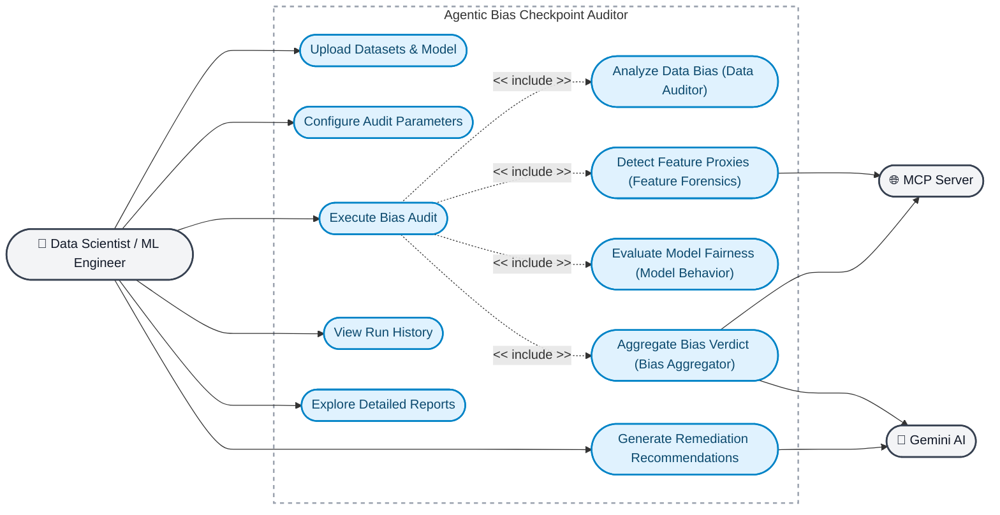

# Agentic Bias Checkpoint Auditor.

A powerful tool to identify where bias originates in your ML pipeline by analyzing three critical checkpoints: **Data → Features → Model**.

## 🎯 Overview

The Bias Auditor uses four specialized AI agents to analyze your ML pipeline:

1. **Data Auditor** - Detects underrepresentation, missing groups, and label imbalance
2. **Feature Forensics** - Identifies proxy features and encoding risks
3. **Model Behavior** - Measures fairness gaps and counterfactual sensitivity
4. **Bias Aggregator** - Determines primary bias origin and recommends fixes

### ✨ Enhanced Features

- **🔍 Observability**: Structured logging, execution tracing, and metrics collection
- **🛠️ Custom Tools**: Specialized bias detection tools (SubgroupAnalysis, ProxyDetector, FairnessMetrics, CounterfactualGenerator)
- **🌐 MCP Integration**: Bias pattern knowledge base via MCP server
- **🤖 Gemini AI**: LLM-powered explanations and recommendations using Google's Gemini API

## 🚀 Quick Start

### Prerequisites

- Python 3.9 or higher
- pip package manager

### Installation

1. **Clone and navigate to the project directory:**
   ```bash
   cd bias-auditor
   ```

2. **Install dependencies:**
   ```bash
   pip install -r requirements.txt
   ```

3. **Configure Gemini API (Optional but Recommended):**
   ```bash
   # Copy the example env file
   copy .env.example .env
   
   # Edit .env and add your Gemini API key
   # GEMINI_API_KEY=your_api_key_here
   ```
   
   Get your API key from: https://aistudio.google.com/app/apikey

### Running the Application

1. **(Optional) Start the MCP Server:**
   ```bash
   cd mcp_server
   python server.py
   ```
   
   The MCP server provides bias pattern resources at `http://localhost:8001`

2. **Start the backend API:**
   ```bash
   cd backend
   python main.py
   ```
   
   The API will be available at `http://localhost:8000`

3. **Start the frontend (in a new terminal):**
   ```bash
   cd frontend
   streamlit run app.py
   ```
   
   The UI will open in your browser at `http://localhost:8501`
## User Case diagram


## 📋 Usage

### 1. Prepare Your Data

You need three files:

- **raw_data.csv** - Raw training data with:
  - Sensitive attributes (e.g., gender, race, age)
  - Target column (binary: 0/1)
  - Other features

- **processed_features.csv** - Engineered features (row-aligned with raw data)

- **model.pkl** - Pickled scikit-learn compatible model

### 2. Run an Audit

1. Navigate to "New Audit" in the sidebar
2. Upload your three files
3. Select target column and sensitive attributes
4. Adjust thresholds (optional)
5. Click "Start Audit"

### 3. View Results

1. Navigate to "Run History"
2. Select your run
3. View the bias origin verdict
4. Explore detailed analysis in tabs:
   - **Data** - Subgroup statistics and label distribution
   - **Features** - Proxy features and encoding risks
   - **Model** - Fairness metrics and counterfactual tests
   - **Recommendations** - Actionable fixes

## 🔍 What It Detects

### Data Checkpoint
- ❌ Underrepresented groups (<5% of data)
- ❌ Missing expected demographic categories
- ❌ Severe label imbalance (ratio >4:1)

### Feature Checkpoint
- ❌ Proxy features (high correlation with sensitive attributes)
- ❌ Target leakage
- ❌ Sparse one-hot encoding issues

### Model Checkpoint
- ❌ Demographic parity violations (acceptance rate gaps)
- ❌ Equal opportunity violations (TPR gaps)
- ❌ Equalized odds violations (TPR + FPR gaps)
- ❌ Counterfactual sensitivity

## 📊 Example Test Data

To test the system, you can generate synthetic biased data:

```bash
python scripts/generate_test_data.py
```

This creates:
- `test_data/raw_data.csv`
- `test_data/processed_features.csv`
- `test_data/model.pkl`

Upload these files to see the auditor in action!

## 🏗️ Architecture

```
bias-auditor/
├── backend/
│   ├── main.py              # FastAPI application
│   ├── database.py          # SQLite database
│   ├── models.py            # Pydantic models
│   ├── orchestrator.py      # Agent coordination with observability
│   ├── observability.py     # Logging, tracing, metrics
│   ├── gemini_agent.py      # Gemini AI integration
│   ├── mcp_client.py        # MCP client
│   ├── utils.py             # Shared utilities
│   ├── agents/              # Specialized agents
│   │   ├── data_auditor.py
│   │   ├── feature_forensics.py
│   │   ├── model_behavior.py
│   │   └── bias_aggregator.py
│   └── tools/               # Custom bias detection tools
│       ├── base.py          # Tool framework
│       └── bias_detector.py # Bias detection tools
├── mcp_server/              # MCP server for bias patterns
│   ├── server.py            # HTTP server
│   └── resources.py         # Bias pattern knowledge base
├── frontend/
│   └── app.py               # Streamlit UI
├── data/                    # Run artifacts (auto-created)
│   ├── logs/                # Structured logs
│   ├── traces/              # Execution traces
│   └── metrics/             # Performance metrics
└── requirements.txt
```

### 🎓 Course Concepts Demonstrated

This project demonstrates **5 key concepts** from the Agentic AI course:

1. **Sequential Agents** - Four agents execute in sequence (Data → Features → Model → Aggregator)
2. **State Management** - SQLite database tracks run status and configuration
3. **Observability** - Structured logging, execution tracing, and metrics collection
4. **Custom Tools** - Specialized tools for bias detection (SubgroupAnalysis, ProxyDetector, etc.)
5. **LLM Integration (Gemini API)** - AI-powered explanations and recommendations

## 📖 API Documentation

Once the backend is running, visit:
- Swagger UI: `http://localhost:8000/docs`
- ReDoc: `http://localhost:8000/redoc`

### Key Endpoints

- `POST /runs` - Create new audit run
- `GET /runs` - List all runs
- `GET /runs/{run_id}` - Get run details
- `GET /runs/{run_id}/artifacts/{type}` - Get JSON artifact
- `GET /runs/{run_id}/plots/{name}` - Get plot image

## ⚙️ Configuration

Default fairness thresholds (adjustable in UI):

```json
{
  "demographic_parity_diff_threshold": 0.1,
  "equal_opportunity_diff_threshold": 0.1,
  "equalized_odds_diff_threshold": 0.1,
  "min_group_proportion_threshold": 0.05,
  "min_support_for_metrics": 30,
  "proxy_corr_threshold": 0.3,
  "counterfactual_change_threshold": 0.1,
  "label_imbalance_ratio_threshold": 4.0
}
```

## 🔧 Troubleshooting

### Backend won't start
- Check if port 8000 is available
- Ensure all dependencies are installed: `pip install -r requirements.txt`

### Frontend can't connect to backend
- Verify backend is running at `http://localhost:8000`
- Check CORS settings in `backend/main.py`

### Model loading fails
- Ensure model is scikit-learn compatible
- Model must have `predict()` and `predict_proba()` methods

## 📝 Limitations (MVP)

- Binary classification only
- Scikit-learn compatible models only
- Local filesystem storage (not production-ready for scale)
- Synchronous processing (no async workers)

## 🛣️ Roadmap

Future enhancements:
- Multi-class classification support
- Async processing with Celery
- PostgreSQL support
- Authentication & authorization
- Batch processing
- Export reports as PDF

## 📄 License

MIT License - See LICENSE file for details

## 🤝 Contributing

Contributions welcome! Please:
1. Fork the repository
2. Create a feature branch
3. Submit a pull request

## 📧 Support

For issues or questions, please open a GitHub issue.
